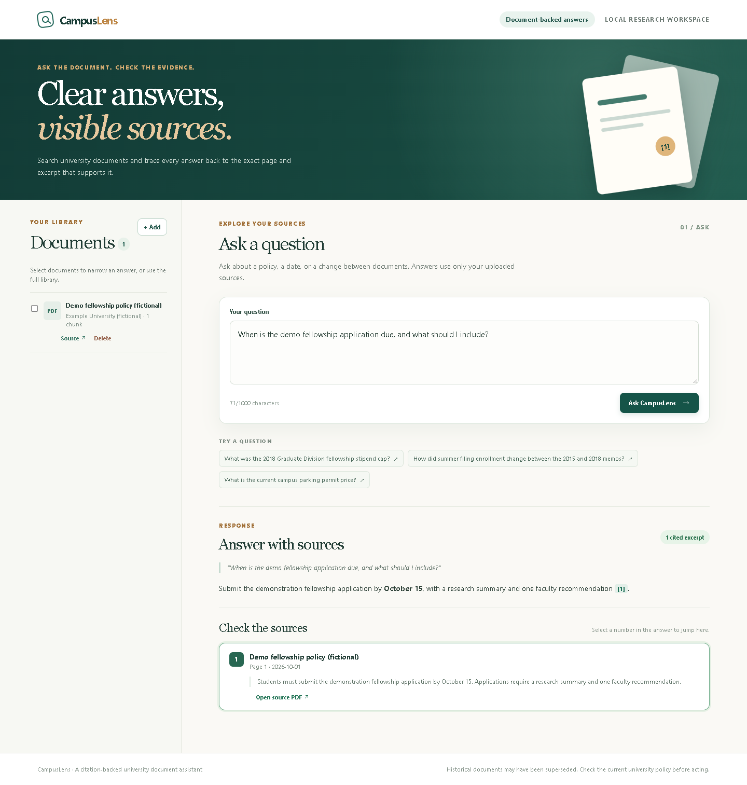
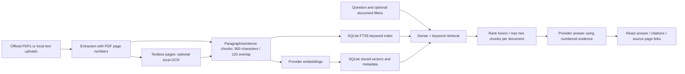

# CampusLens

A citation-backed university document assistant. The backend ingests text PDFs and UTF-8 text files, searches page-aware chunks with semantic and keyword retrieval, and answers with numbered source excerpts. The React demo lets visitors ask questions and open the cited page evidence.

M3 uses a fixed [retrieval question set](eval/questions.jsonl) and separate [page labels](eval/labels.jsonl). On 50 answerable questions from the 33-document Berkeley memo corpus, hybrid search measured Hit@5 of 50/50 and MRR@10 of 0.9367, versus keyword MRR@10 of 0.9133. These are retrieval metrics, not answer or citation accuracy. See [the evaluation record](docs/evaluation.md) for the full comparison and limits.

## See the local app

CampusLens is a local portfolio app. There is no hosted demo or public API; run it on your own machine with your own provider key using the setup instructions below.



The screenshots use a **fictional policy and fixed API responses** to illustrate the interface. They are not live model outputs or evidence for the evaluation scores. The citation displays its document title, page number, and supporting excerpt. Opening the source link leads to [this fictional source-page illustration](docs/screenshots/source-page.png), rendered as HTML for repeatable capture; a real corpus citation opens the original PDF at the cited page. See the [mobile view](docs/screenshots/mobile.png) as well.

Regenerate all three screenshots from `frontend/` with `npm ci` and `npm run screenshots`. This uses headless Microsoft Edge and makes no provider calls. Set `CAMPUSLENS_BROWSER` to another Chromium executable if needed. The capture script checks citation navigation, source opening, and horizontal overflow.

## Architecture and design choices



PDF page identity and original URLs survive extraction, storage, retrieval, and answer generation so readers can inspect the evidence. Cleanup preserves paragraph/line breaks, and chunking prefers paragraph and sentence boundaries. Optional local OCR handles pages without extractable text. SQLite keeps the corpus and both retrieval paths in one persistent store; the measured 189-chunk baseline does not yet justify a vector database. Keyword retrieval handles exact policy terms, while dense retrieval supports paraphrases. Reciprocal rank fusion combines their rankings. Production context limits repeated chunks from one document after a measured multi-document coverage failure. The API returns a refusal when it cannot verify citation numbers; that check does not prove every claim is supported, which is why answer support is reviewed separately.

## Measured results and limits

The September 27, 2026 baseline used the same 33-document snapshot and 60 fixed questions for every mode. Fifty questions were answerable; ten no-answer questions are excluded from the retrieval relevance metrics.

| Mode | Hit@5 | MRR@10 | Local retrieval p50 | Local retrieval p95 |
| --- | ---: | ---: | ---: | ---: |
| Keyword | 50/50 | 0.9133 | 3.956 ms | 5.546 ms |
| Dense | 50/50 | 0.9290 | 56.728 ms | 67.740 ms |
| Hybrid baseline | 50/50 | 0.9367 | 58.590 ms | 67.298 ms |

Hybrid improved MRR by 0.0234 over keyword search while adding about 54.6 ms at p50. These single-run local timings exclude query embedding, HTTP, and answer generation. In a separate matched October 2 run, limiting hybrid context to two chunks per document improved two-document coverage from 7/8 to 8/8 without changing Hit@5 or MRR; timing varied substantially between runs. See [the method and weak-case review](docs/evaluation.md) and [raw baseline results](eval/baseline_results.json).

This focused corpus and questions written from known memos limit generalization. PDFs are historical (2013–2022), may be superseded, and are downloaded rather than redistributed. OCR is optional and can misread text; table relationships are not reconstructed. Retrieval scans stored vectors and has not been load-tested at large scale. Answer evaluation remains incomplete: 26/30 baseline responses are reviewed, with 17/20 answerable responses fully supported and 17/20 with citations supporting every material claim. Six reviewed no-answer cases refused correctly; four remain unrun, and the same-sample revised-answer comparison is on hold for quota. See [the answer rubric and partial findings](docs/answer-evaluation.md). The screenshots demonstrate presentation, not model quality.

An October 3 extraction/chunking comparison on the same cached PDF hashes retained all 57 indexed pages and produced 228 chunks versus the baseline's 189. Keyword Hit@5 remained 50/50, MRR@10 changed from 0.9133 to 0.9167, and both required documents appeared in the top five for 8/8 questions versus 7/8. This is a **keyword-only** check, not a new dense/hybrid or answer evaluation. Existing databases and baseline results were left intact. See [the extraction comparison](docs/ingestion-validation.md#extraction-upgrade-2026-10-03).

[Portfolio notes](docs/portfolio.md) contain a resume bullet based on these measured results, a two-minute explanation of the hybrid-search tradeoff, and a five-minute repository tour.

## Backend layout

`app/main.py` creates the FastAPI app and wires dependencies. `app/routes.py` declares HTTP endpoints and `app/schemas.py` defines their request and response shapes. `app/services.py` coordinates ingestion and cited answers; `app/model_gateway.py` selects the model provider and translates its failures. `app/documents.py` extracts and chunks files, `app/store.py` owns SQLite document storage, and `app/retrieval.py` ranks embedding and FTS5 results. This keeps the retrieval logic in one place for the M3 comparisons.

## Run the backend

Requires Python 3.10+, [uv](https://docs.astral.sh/uv/), and a Gemini API key (or an OpenAI API key if you select that provider). From `backend/`:

```powershell
uv sync --extra dev --native-tls
if (-not (Test-Path .env)) { Copy-Item .env.example .env }
# Edit .env and set GEMINI_API_KEY; keep CAMPUSLENS_PROVIDER=gemini
uv run uvicorn app.main:app --reload
```

Open <http://127.0.0.1:8000/docs> for the interactive API and its response schemas. The SQLite database is created at `backend/data/campuslens.sqlite3` by default. `.env`, downloaded PDFs, and the database are ignored by Git. To use OpenAI, set `CAMPUSLENS_PROVIDER=openai` and `OPENAI_API_KEY` in `.env` instead. Changing the embedding provider or model requires replacing or re-uploading documents; `/ask` returns 409 for an index built with a different embedding profile. The local frontend origins default to `http://localhost:5173` and `http://127.0.0.1:5173`; override them with the comma-separated `CAMPUSLENS_CORS_ORIGINS` setting.

## Optional OCR and extraction settings

Normal text PDFs and UTF-8 files work with the standard installation. To read image-only PDF pages, install the optional Python dependencies and the local [Tesseract engine and language data](https://tesseract-ocr.github.io/tessdoc/Installation.html). OCR uses your machine's CPU; it sends no images to a model provider.

From `backend/` on Windows:

```powershell
uv sync --frozen --extra dev --extra ocr --native-tls
winget install --id UB-Mannheim.TesseractOCR --exact --source winget
```

Set these in `backend/.env`, then restart the backend:

```dotenv
CAMPUSLENS_OCR_ENABLED=true
CAMPUSLENS_OCR_LANGUAGE=eng
# Use the actual installation path if Tesseract is not on PATH.
CAMPUSLENS_OCR_COMMAND=C:/Program Files/Tesseract-OCR/tesseract.exe
CAMPUSLENS_OCR_MAX_PAGES=10
CAMPUSLENS_OCR_TIMEOUT_SECONDS=10
```

On Debian/Ubuntu install `tesseract-ocr` and `tesseract-ocr-eng`; on macOS use `brew install tesseract`. Leave `CAMPUSLENS_OCR_COMMAND=tesseract` when the executable is on PATH. Additional languages require their Tesseract trained data; for example, `eng+hin` needs both English and Hindi installed. The Docker backend includes English Tesseract and the Python OCR extra; enable OCR in the root `.env` and recreate the service with `docker compose up --build -d --wait`.

OCR runs only on pages with **no cleaned extractable text**. Text-layer pages, including scans with an existing OCR layer, keep their text; quality warnings do not trigger automatic OCR or word repair. Each recovered page keeps its original PDF page number and a warning to verify names, dates, and values. A genuinely blank page can still have no text after OCR. A fully unreadable PDF is rejected. Missing dependencies/engine, recognition failure, or a timeout rejects ingestion before embedding, leaving the old index unchanged on replacement.

Default OCR bounds are ten pages per upload, ten seconds of recognition per page, 200 DPI, and twelve million rendered pixels per page. `CAMPUSLENS_OCR_MAX_PAGES` accepts 1–100, and timeout accepts 1–60 seconds. These bound OCR work but are not a whole-request deadline; PDF parsing/rendering and queued work add time. Large scans should be split into smaller files. Tables, reading order, handwriting, and imperfect OCR still need manual review. [PDFium's thread-safety requirement](https://pypdfium2-team.github.io/pypdfium2/python_api.html) is handled with a rendering lock.

Text cleanup normalizes Unicode/whitespace and removes soft hyphens, zero-width spaces, and stray controls while retaining line and paragraph breaks. It does not guess missing words, join ordinary hyphenated line endings, or change dates and amounts. Warnings flag control/replacement characters and unusually fragmented single-letter text; these are heuristics, not a guarantee of good extraction. Chunks stay within one page and prefer paragraph, sentence, then word boundaries; unusually long tokens are split to respect the size limit. The default maximum is 900 characters including retained whitespace, with up to 120 characters of whole-word overlap.

Existing documents retain their stored chunks. To adopt the new extraction/chunking, use the existing manifest command with `--force` or replace a manual upload. Rebuilding consumes embedding quota; it is not done automatically, and the saved M3/M4 baselines remain unchanged. To repeat the provider-free cached-corpus comparison from `backend/`:

```powershell
uv run --no-sync python -m scripts.evaluate_extraction
```

This requires PDFs already cached by manifest ingestion with hashes matching `eval/corpus_snapshot.json`. It creates temporary keyword indexes and writes `eval/extraction_results.json`; it does not call embeddings, OCR, or answer models. `scripts.inspect_corpus --ocr` can inspect extraction including empty-page OCR before embedding.

## API

| Endpoint | Purpose |
| --- | --- |
| `GET /health` | Health check |
| `POST /documents` | Upload a `.pdf` or `.txt` file (multipart field `file`, max 10 MB) |
| `PUT /documents/{id}` | Replace a document's file and index, keeping its ID and omitted source metadata |
| `GET /documents` | List uploaded documents |
| `DELETE /documents/{id}` | Delete a document and its search index entries |
| `POST /ask` | Ask `{ "question": "When is tuition due?" }` |

Run tests with `uv run --no-sync pytest`. OCR tests needing Python extras skip when those extras are absent; the real recognition test additionally needs Tesseract. CI installs both and exercises an image-only PDF. Local mode is intended for loopback development. The Compose deployment enables password protection and request limits.

`POST /ask` also accepts optional exact-match `institution` and `document_ids` filters. They constrain both keyword and embedding retrieval before the answer is generated. `GET /documents` includes each file's SHA-256 so the corpus command can skip unchanged files.

## Berkeley Graduate Division memo corpus (M2)

The [manifest](corpus/berkeley_graduate_memos.json) lists 33 public PDFs linked from UC Berkeley's [Guide to Graduate Policy](https://grad.berkeley.edu/academics/policy/). The scope is **historical Graduate Division policy and procedure memos from 2013–2022**, not current policy advice. Some memos amend or supersede others; users should check the current guide before acting on an answer. The manifest records title, original PDF URL, institution, publication date, file type, and the date the source list was checked. Two image only PDFs were excluded because the current extractor cannot read them. [Corpus extraction notes](docs/corpus-validation.md) record the check.

PDF redistribution rights are unclear, so the repository contains the manifest and scripts, not the PDFs. Downloads go to ignored `backend/data/corpus/`. To recreate the index from a clean checkout, first configure the provider as above and start the API. Then, in another terminal from `backend/`, run:

```powershell
uv sync --extra dev --native-tls
uv run --no-sync python -m scripts.ingest_corpus --check
uv run --no-sync python -m scripts.inspect_corpus
uv run --no-sync python -m scripts.ingest_corpus
```

The command downloads only the 33 listed official PDFs, rejects redirects to other hosts and files above the API's 10 MB limit, and uploads each with source metadata. It compares downloaded SHA-256 values with `GET /documents`: unchanged files skip embedding, changed files replace their existing document ID. Uploads are spaced four seconds apart by default, and HTTP 429 responses receive two bounded retries. A repeated rate limit stops the run; rerun later to resume from indexed hashes. Override pacing with `--upload-delay` and retries with `--rate-limit-retries`. Other failed downloads or uploads are reported and make the command exit nonzero. For a small paid smoke test, use `--limit 1`. `scripts.inspect_corpus --all` checks every PDF's extractable pages without calling the model. Public sources may change after the manifest's retrieval date; the command records the bytes it receives at run time through their indexed hashes.

## Retrieval evaluation (M3)

After recreating the corpus with the M2 ingestion workflow, run from `backend/` against the default database:

```powershell
uv run --no-sync python -m scripts.validate_eval --db data/campuslens.sqlite3
uv run --no-sync python -m scripts.evaluate_retrieval --db data/campuslens.sqlite3
```

The evaluation checks document hashes against [the fixed snapshot](eval/corpus_snapshot.json), compares keyword, dense, and hybrid rankings, and writes [detailed results](eval/baseline_results.json). It embeds 60 questions on the first run and caches the vectors in ignored `backend/data/`; later runs reuse them. The [evaluation record](docs/evaluation.md) defines the metrics, reports local retrieval latency, and reviews weaker cases. Rebuilding from changed public PDFs or a different embedding profile requires a new snapshot and labels before comparing scores.

## Answer and citation evaluation (M4)

The [fixed answer sample](eval/answer_sample.json) has 30 questions, including all ten no-answer cases. [The rubric](docs/answer-evaluation.md) scores factual support, completeness, citation correctness, and refusal separately. After rebuilding the matching index, run from `backend/`:

```powershell
uv run --no-sync python -m scripts.evaluate_answers --db data/campuslens.sqlite3
uv run --no-sync python -m scripts.summarize_answer_review
```

The first command uses cached M3 query embeddings and the production answer service. It resumes completed IDs from ignored `backend/data/answer_baseline.jsonl`. Full cited excerpts stay in that ignored local file; [manual judgments](eval/answer_review.jsonl) contain concise reasons without redistributing source text. The baseline run saved and reviewed 26 of 30 answers across September 27 and October 2. All 20 answerable cases have been reviewed; four no-answer cases remain because of the selected Gemini model's daily free-tier generation limit. `/ask` now caps hybrid context at two chunks per document after a measured two-document coverage failure. The baseline runner stays on the original `hybrid` mode; pass `--retrieval-mode hybrid_diverse --output data/answer_diverse.jsonl` to evaluate the revised mode into a separate file. See [the answer evaluation record](docs/answer-evaluation.md) for measured retrieval changes, partial answer counts, and remaining work.

## Demo interface (M5)

The [React and TypeScript frontend](frontend/) shows answers with clickable citation numbers, source title, PDF page, excerpt, and original URL. It also supports document upload, selection, listing, and deletion. Empty, loading, error, and unsupported-answer states are shown in the interface. The initial corpus is historical Berkeley memos; the interface and API accept documents from other institutions.

Use Node.js 22.12+ and npm. Start the backend as described above, then run this in a second terminal from `frontend/`:

```powershell
npm ci
npm run dev
```

Open <http://127.0.0.1:5173/>. Vite proxies `/api` to the FastAPI server at `http://127.0.0.1:8000`, so no frontend API key is needed. If you host the frontend separately, set `VITE_API_BASE_URL` to the backend's public base URL and configure backend CORS accordingly. Do not put provider keys in frontend environment variables. Uploading and asking live questions use the selected provider's quota.

If npm on this Windows machine reports `UNABLE_TO_VERIFY_LEAF_SIGNATURE`, the local ignored `backend/data/npm-ca-bundle.pem` generated from Windows trusted roots can be used in that terminal before `npm ci`: `$env:NODE_EXTRA_CA_CERTS=(Resolve-Path ../backend/data/npm-ca-bundle.pem).Path`. Keep certificate verification enabled.

Run `npm run build` for a production bundle and `npm run smoke` for a browser smoke test using Microsoft Edge. The smoke test mocks API responses so it does not spend model quota; it checks desktop and mobile widths, keyboard navigation, citation links, document filters and management, refusal, loading, error, and empty states. Set `CAMPUSLENS_BROWSER` to another Chromium executable path if Edge is unavailable. A local proxy check also returned `ok` from `/api/health` and loaded all 33 indexed documents from the existing backend without calling the model.

## Optional local Docker setup (M6)

Requires Docker Engine/Desktop with Compose v2. From the repository root:

```powershell
Copy-Item .env.example .env
# Edit root .env: set a unique random access password (16+ characters),
# access username, and the selected provider's key.
docker compose up --build -d --wait
docker compose ps
curl.exe --fail http://localhost:8080/health
# curl prompts for the access password; it is not placed in shell history.
curl.exe --fail --user demo http://localhost:8080/api/documents
```

Open <http://localhost:8080/> and enter the access credentials in the browser's sign-in dialog. Replace `demo` in commands if you chose another username. The frontend uses the same origin `/api` proxy; no credentials or provider keys are compiled into the browser bundle. The root `.env` is for Compose; `backend/.env` remains the separate local development configuration. In production, provide the same variables through your hosting platform's secret/environment settings. Both files are ignored, and the Docker build context excludes them.

The named `index-data` volume holds the database and corpus download cache. `docker compose down` preserves it; `docker compose down --volumes` deletes it. The backend runs as an unprivileged user and has no published port. Health checks test the API's database access and the frontend proxy without calling a provider. Compose waits for the backend health check before starting the frontend, following [Docker's startup-order guidance](https://docs.docker.com/compose/how-tos/startup-order/).

Public mode refuses to start without a username and a password of at least 16 characters. All API routes except health and CORS preflight require HTTP Basic authentication, including uploads, replacement, deletion, document listings, and questions. Nginx uses the backend access check to protect the site and display the browser sign-in dialog, as described in [Nginx's auth request documentation](https://nginx.org/en/docs/http/ngx_http_auth_request_module.html). Use this as a private reviewer demo: anyone given the shared credentials can ask questions and manage documents.

This repository's delivery target is local use and screenshots. Compose binds port 8080 to loopback and keeps port 8000 inaccessible. Its `public` backend mode is the existing strict-authentication setting; using it here protects the local packaged app and does not publish a public service. No hosted URL is required.

The single backend process allows at most 10 authenticated write requests per rolling minute by default, shared across users and `/ask`, upload, replacement, and deletion. Override `CAMPUSLENS_REQUESTS_PER_MINUTE` to change that budget. Rejections return 429 and `Retry-After: 60`. The limiter is in memory and resets on restart; keep one worker and one replica, or replace it with a shared limiter before scaling. Bodies are bounded before parsing, including streamed requests: `/ask` allows 16 KiB, and uploads allow the 10 MiB file limit plus 64 KiB multipart overhead. Uvicorn also bounds concurrency. Authentication failures never reach model calls.

To populate the deployed database, run the manifest command inside the backend container. It automatically reads the deployment access credentials from its environment:

```powershell
docker compose exec backend uv run --no-sync python -m scripts.ingest_corpus --check
docker compose exec backend uv run --no-sync python -m scripts.ingest_corpus --api-url http://localhost:8000 --cache-dir /data/corpus --upload-delay 7
```

This ingestion uses provider quota. To rebuild after changing embedding settings, add `--force` to that command. It re-embeds and atomically replaces each manifest document while preserving its ID; rerunning normally skips unchanged files. Rebuild every document before asking with a changed embedding profile; manual uploads must be replaced separately. Avoid queries during the rebuild. Failed replacements preserve the prior document; rerun to recover. The existing M4 evaluation remains on hold and is not part of deployment verification.

Use `docker compose logs --tail 100 backend` for structured JSON request/error records with request IDs, status, route category, and duration. Logs exclude request bodies, credentials, provider error text, and stack traces. Provider failures retain their sanitized API error response; unexpected failures return a generic 500. Health indicates database readiness, not provider quota availability.

[CI](.github/workflows/ci.yaml) runs backend tests, frontend TypeScript checks (`npm run lint`) and build, plus a fresh Compose build/start, unauthenticated rejection, authenticated access, and restart check without provider keys. Here, `lint` checks TypeScript's strict and unused-code rules; it does not include a separate ESLint policy. Local validation passed 32 backend tests, frontend checks, and browser smoke tests. On October 3, 2026, `uv run --no-sync python -m scripts.local_setup_smoke` also started the README's local server path with a fresh temporary database and checked health, empty listings, and an empty-corpus answer without provider calls. The same smoke check and all 32 tests also passed in a new temporary virtual environment installed from the frozen backend lockfile. Frontend npm ci, lint, and build passed as well. Docker is unavailable on the development machine, so the optional container workflow remains unverified locally; local delivery does not depend on a hosted deployment.

## Live PDF smoke test

After setting your selected provider's key in `backend/.env`, run this from `backend/` to download a public Berkeley policy PDF into the ignored `data/` directory and test upload plus two questions against a temporary SQLite database:

```powershell
New-Item -ItemType Directory -Force data/validation | Out-Null
curl.exe -L --fail --output data/validation/berkeley-exam-proctoring.pdf https://asc.berkeley.edu/sites/default/files/proctoring_guidlines_2024-10-08.pdf
uv run --no-sync python -m scripts.smoke_test data/validation/berkeley-exam-proctoring.pdf
```

The script asks when student athletes must meet professors about exam conflicts and asks an unrelated pet iguana question. Check that the first answer cites the policy page and the second explicitly says the uploaded document has no answer. It prints the answers and citation metadata; it never prints the API key. Live requests use API quota. If a provider rejects authentication, model configuration, or rate limits, the API returns a short 503 or 429 error rather than provider internals.

An upload can also include optional form fields: `title`, `source_url`, `institution`, and `published_or_updated_date` (ISO date such as `2026-07-01`). `source_url` must use HTTP or HTTPS and is stored for citations; the API does not fetch it. When `title` is omitted, citations use the filename. Existing SQLite databases are migrated automatically on startup.

The upload response and `GET /documents` include `extraction_warnings` for PDF pages without extractable text. Chunk size and overlap can be set with `CAMPUSLENS_CHUNK_SIZE` and `CAMPUSLENS_CHUNK_OVERLAP` (defaults: 900 and 120 approximate characters). See [PDF ingestion validation](docs/ingestion-validation.md) for observed results and limits on three university PDFs.
